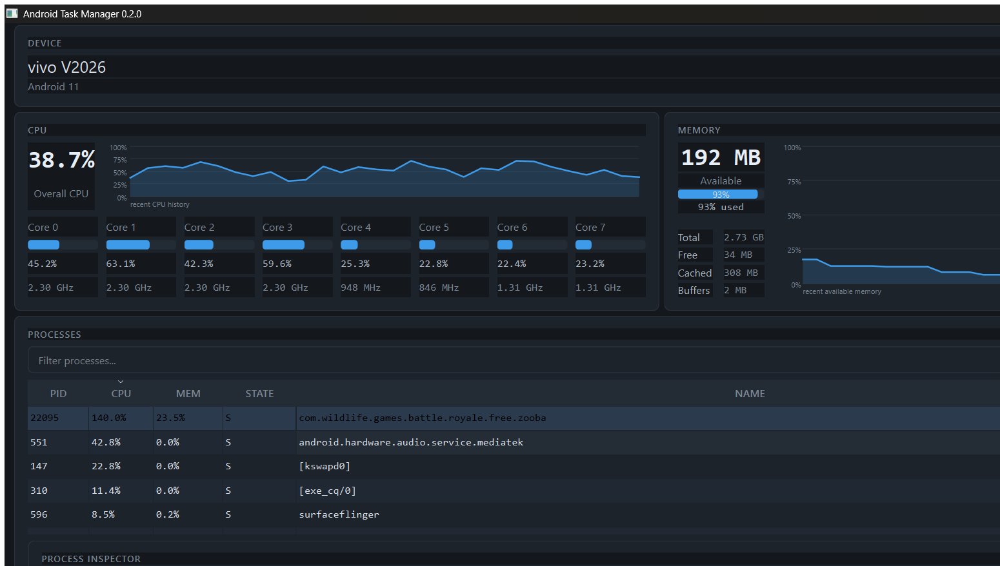

<div align="center">

# Android Task Manager

**A live Android/Linux system monitor for your PC — CPU, memory, processes, battery and network, pulled from a connected Android device over ADB — with a package-verified application manager (open, info, force stop, enable/disable, uninstall) and a deterministic device-intelligence layer (health engine, event timeline, monitoring rules, recommendations and safe, approved automation).**

[](https://www.python.org/downloads/)
[](https://doc.qt.io/qtforpython-6/)
[](https://developer.android.com/tools/adb)
[](https://github.com/kalyandhoni234-hash/Android-task-manager/actions/workflows/ci.yml)
[](https://github.com/kalyandhoni234-hash/Android-task-manager/releases)
[](LICENSE)

**Android Task Manager** is a PC-side monitoring tool that talks to an Android device over **ADB** and renders live system telemetry — CPU (aggregate, per-core, per-core frequency), memory pressure (`MemAvailable`), process tables with per-process metrics, battery state, and network throughput — either as a lightweight **terminal dashboard** or as a full **PySide6 desktop GUI**.

**Get it — no Python required:**

[](https://github.com/kalyandhoni234-hash/Android-task-manager/releases/download/v0.7.0/AndroidTaskManager.exe)
[](https://kalyandhoni234-hash.github.io/Android-task-manager/)
[](https://github.com/kalyandhoni234-hash/Android-task-manager/releases)

</div>

---

## Overview

Android Task Manager turns *your* PC into a window into *your* Android device. The device is never required to install anything: the app reaches it through `adb shell` and reads standard Linux/Android interfaces — `/proc`, `/sys/devices`, `dumpsys` and `pm` — parses the raw output, and normalizes it into typed models that the terminal and the GUI render.

Two ways to use it:

- **Terminal mode** — a dependency-light interactive dashboard (CPU / memory / processes / battery / network) with per-reader sampling cadences you control.
- **Desktop GUI (PySide6)** — a live dashboard with history graphs, a selectable process table, an on-demand **Process Inspector** (`/proc/<pid>`), a per-process **Network Connections** investigation (socket tables), a **Diagnostics** page (evidence-based device health findings), a per-device **baseline persistence** store, an **exportable device report**, an **Applications manager** (installed-app inventory with per-package details and capability-gated device actions), explicit, package-verified device actions: **Open App**, **App Info**, **Force Stop**, **Enable/Disable**, **Uninstall** — and a **Device Intelligence** page (device health score, findings, event timeline, monitoring rules, recommendations, and approved, non-destructive automation).

Monitoring and inspection are **read-only**. The only interactive operations are the six device actions, each requires an explicit selection, each runs only against a package whose identity has been verified against the device's installed-package list, and the destructive ones (force stop, disable, uninstall) require an explicit confirmation that names the exact target package. Automation (v0.8) never runs a destructive action, ever — its targets must be verified installed *and* user-category packages, and every automated action still requires the user's explicit Apply click.

## ✨ Features

### 📊 System Monitoring

- **CPU** — aggregate utilization from `/proc/stat` *deltas* between two samples (never a single snapshot), per-core utilization, and per-core frequency from `scaling_cur_freq` sysfs nodes. First sample reports `N/A` (a delta has no baseline yet).
- **Memory** — `MemAvailable` as the primary pressure indicator (not `MemFree`: cache is reclaimable), used-share, and Total / Available / Free / Cached / Buffers breakdown. Values normalized to KiB.
- **Battery** — level (`level / scale`), charging status and health (Android enum numbers normalized to human-readable states), voltage, temperature (0.1 °C → °C), technology and power source.
- **Network** — download/upload throughput from `/proc/net/dev` *deltas* (bytes per second), interface classification (Wi-Fi / Mobile Data / VPN / …) by a documented heuristic, and interface filtering (active-only by default with a *show all* toggle).
- **Storage** — live used-share of the internal `/data` volume, re-read on its own slow cadence (default 30 s) and classified against the same canonical thresholds as the other metrics.
- **History graphs** (GUI) — bounded live windows for CPU, memory, network and battery so you can see recent trends, not just the current value.

### 📈 Live Dashboard *(GUI)*

- The **Overview page leads with a LIVE METRICS row**: CPU, RAM, Battery and Storage cards showing the current value, a bounded trend graph and warning/critical coloring from the canonical thresholds (`80%` storage → amber, `90%` → red; battery below `35%` → amber, `20%` → red).
- Trends are **session-bound**: history resets when the device disconnects, a missing value renders as an honest "—", and a refresh never duplicates a sample for an unchanged metric.
- The dashboard is pure presentation: it consumes only snapshots the monitor already collected — no extra ADB traffic and no timers of its own.

### 🔎 Process Monitoring & Inspector

- Live process table (GUI): **PID, UID, CPU%, MEM%, State, Name**, default-sorted by CPU usage, with name filtering and sorting of CPU/memory.
- Process classification — a documented heuristic: bracketed names (`[kworker/0:1]`) → kernel thread; `uid < 10000` → system; otherwise → user/app. The monitor's own helper process is hidden from the table.
- Identity comes from `ps -A -o PID,UID,NAME` (authoritative); dynamic metrics come from `top -n 1` and are merged **by PID** — never by name or row order. `%CPU` above 100 is kept as-is (multi-core), not clamped.
- **Process Inspector** (GUI) — on-demand, read-once inspection of a selected process:
  - `/proc/<pid>/status` → Name, State, UID, Threads, Virtual (`VmSize`), Resident (`VmRSS`), Shared (`RssShmem`).
  - `/proc/<pid>/stat` → priority, nice, thread count (used as fallbacks; parsed around the `comm` group so names with spaces/parentheses are safe).
  - `/proc/<pid>/cmdline` → NUL-separated argv, space-joined; empty → `N/A`, nothing invented.
  - `/proc/<pid>/io` → optional `read_bytes`/`write_bytes`; when the file is permission-protected, both stay `N/A` — never a fabricated zero.
  - If the process exits mid-inspection, the panel shows a clean *"Process no longer available"* state instead of crashing.
  - Inspections run on a **background worker thread**; the dashboard keeps sampling while a read is in flight.

### 🔍 Process Search & Sorting

- Sort the process table by **CPU** or **memory** (highest first) and **filter** by name — the table re-renders from the latest snapshot without touching the device.

### ⚡ Device Actions *(GUI, explicit, package-verified)*

- **Open App** — resolved to a verified launch component and started with `am start -W -n`.
- **App Info** — opens the Android settings page for the package (via `am start` targeting the app-details intent).
- **Force Stop** — `am force-stop <package>`.
- **Enable / Disable** — `pm enable` / `pm disable-user --user 0`; the toggle appears only when the device reported a concrete enabled state, and re-enabling is always offered for a disabled app.
- **Uninstall** — `pm uninstall <package>` (user-data removal; never `-k`). Never offered for system applications.
- **Identity is never guessed.** Every action is resolved through the `PackageResolver`: an in-memory, reconnect-refreshed view of the device's installed packages (`pm list packages`). A process without a positive verification against the installed list has **no** application identity — nothing is acted on, and a rejected candidate (e.g. a shell module, a non-app module process, a secondary-process suffix) is rejected up front.
- **Capability gate.** Buttons are derived only from the current package details via `action.capability`: system applications never see uninstall/disable controls, and a disabled app always gets Enable. The window layer re-validates the gate before every dispatch (defense in depth).
- **Explicit confirmations.** Force Stop, Disable and Uninstall always ask for confirmation that names the exact target package — no one-click destructive action.
- **Typed outcomes.** Every action returns a typed result (success / typed failure: not found, not supported, permission denied, invalid target, device lost); permission-denied results are detected from the device output, not guessed.
- Deliberately **no** kill-all, no cache/data clearing, no restarts — no write access of any other kind.

### 📦 Applications Manager *(GUI)*

- The **Applications page** (sidebar → MANAGE → Applications) lists the installed apps: package, type (SYSTEM / USER), enabled state, UID, version code and APK path, with client-side filtering and numeric-aware column sorting; system rows are tinted so the destructive-control boundary reads at a glance.
- Inventory is normalized from `pm list packages -f -U --show-versioncode` plus the system/user/disabled sets — one typed `ApplicationSnapshot`, honest empty state on failure, and a full refresh whenever the device (re)connects or a state-changing action succeeds.
- Selecting a row reads **per-package details** on demand (`dumpsys package`): version name/code, UID, APK path, install location, installer, enabled state, launch activity, and component counts (activities/services/receivers), parsed with the resolver-table headers matched by action AND category intent so launcher detection never depends on one header's wording.
- The details panel carries the capability-gated action row (Open / Info / Force Stop / Disable|Enable / Uninstall) and an **Audit Permissions** button reusing the shared permission worker.
- **Process → Application flow:** the Process Inspector's **Manage** button jumps from a verified process to its application row, with details selected even when the inventory is stale (falls back to a direct read).

### 🧠 Device Intelligence *(v0.8)*

A deterministic intelligence core that turns the already-collected monitoring data into structure and safe action — **no AI, no model, no cloud**: every engine is a pure function of the typed snapshots the monitor already produced, so the page adds zero ADB traffic of its own.

- **Historical metrics** (`history/`) — bounded, per-session windows of CPU / memory / battery / storage samples (with per-metric bounds), statistics (min/max/mean/last), trends, peak periods and sustained-run analysis; consecutive identical values are deduplicated so a steady device never grows the window artificially.
- **Device health** (`health/`) — a deterministic `evaluate_device_health` engine scores the current snapshots into a 0–100 overall score and per-component statuses (CPU, memory, battery, storage, processes, applications, connectivity) with typed findings (severity, component, evidence). Missing data produces **no finding and no score contribution** — unavailable components are never converted into false health claims, and a device with no readable evidence reports an honest "unavailable" status.
- **Event timeline** (`timeline/`) — a bounded (256-event) chronological history of the session: session start, device connect/disconnect, health changes, rule fires, recommendations and executed actions, each with a deterministic `T-###` id, monotonic + wall-clock timestamps (missing clocks are never fabricated) and deduplicated state transitions.
- **Monitoring rules** (`rules/`) — a rule engine over the session history: metric / operator (`GE`/`GT`/`LE`/`LT`) / threshold / duration (sustained runs) / severity / anti-storm cooldown. Seven built-in rules cover CPU and memory highs (immediate + sustained), battery low/critical and storage high; thresholds come exclusively from the canonical `thresholds.py` module — never restated in the GUI.
- **Recommendations** (`recommend/`) — deterministic finding-to-action mapping: informational guidance for CPU/memory/battery/storage/connectivity, plus per-process `force_stop` proposals for heavy user apps. Targets are proposed only when the process name is a **verified installed package** (identity link to the v0.7 inventory) **and** a **user-category package** (system/protected apps never receive destructive proposals).
- **Controlled automation** (`automation/`) — an approval-gated scheduler over the recommendations: the user's **Apply** click is the explicit approval; the engine then enforces target validation (fails closed), per-(action, target) cooldowns, a per-session execution budget (loop protection) and session scoping. **Destructive actions never run through automation**, even after approval, and the executor is the same v0.7 action worker — every automated action has the exact safety guarantees of a manual one.
- **Finding navigation** — a recommendation row's **View app** jumps to the affected application's details page (verified identity re-checked at the window; the `dumpsys` read runs on the existing apps worker).
- **Background User Apps** (`background/` + Intelligence page section) — answers "which installed **user** apps are running in the background, and how much CPU/RAM are they using?" Process snapshots are resolved to **verified installed user applications** (UID match, then exact/prefixed process-name match against the v0.7 inventory); system/protected processes are excluded, multiple processes per app aggregate into one row (summed CPU/memory, process count), the foreground app is excluded, and each row shows the **human-readable app label** (APK manifest) with the exact **package name as secondary** identity and a package-name fallback when no label resolves. The view is built purely from already-collected snapshots via the existing `MonitorWorker`/`AppsWorker` — it adds **no extra ADB polling** and no second inventory read — and its actions reuse the same v0.7 capability gate (system apps can never be force-stopped/disabled/uninstalled; destructive actions require explicit confirmation naming the exact package).

### 🌐 Network Monitoring

- Delta-based download/upload throughput; traffic aggregated per interface and grouped by type over the active connection.
- Interface classification (Wi-Fi / Mobile Data / VPN / Loopback / Other) is a documented heuristic over interface names — honest about what it infers.
- GUI default shows only active interfaces; *Show all interfaces* reveals idle, loopback and virtual ones.

### 🔬 Per-Process Network Investigation *(GUI)*

- The Inspector's **Network Connections** table reads the device's four socket tables — `/proc/net/tcp`, `tcp6`, `udp`, `udp6` — on a slow cadence (default 10 s) and shows local/remote endpoints and connection states.
- Sockets are attributed to the selected process **by its UID**, resolved against the exact packages sharing that UID (`pm list packages -U`). This is deliberately **not** PID-level attribution: Android exposes no per-socket PID to a non-root process, so the tool says that instead of guessing. See `docs/m14-network-research.md` for the research behind this.
- Each table is read independently: a permission failure on one table never hides the sockets visible in the others, and each readable-source state is reported. When the device refuses the socket reads entirely, the section explains that rather than fabricating data.

### 📋 Automated Incident Reporting *(GUI)*

- **Generate Report** — one click aggregates the session into a deterministic, evidence-backed investigation artifact: findings (drift events, heuristic signals, permission combination flags), evidence rows (processes, sockets, packages, permission audits), a chronological timeline, severity counts and an overall assessment (`REVIEW REQUIRED` / `REVIEW RECOMMENDED` / `INFORMATIONAL` / `NO SIGNIFICANT FINDINGS`).
- **Export JSON / HTML / PDF** — the same self-contained HTML feeds the viewer dialog and the PDF writer; JSON is canonical and deterministic. Every export writes off the GUI thread and always reports back.
- **An investigation artifact, never a verdict.** The report preserves the existing analysis layers' own wording, never concludes "malware"/"compromised", and recommends *investigation steps only* — no uninstall/disable/kill/delete. Unavailable data renders as "Unavailable", never a fabricated zero; every timeline entry carries a real timestamp.
- **Evidence integrity** — every report carries a SHA-256 of its canonical payload (stdlib `hashlib`, no cryptography dependency) to detect accidental change.
- See `docs/adr-0001-incident-reporting.md` for the design decisions (no LLM, read-only by construction, severity semantics, PDF placement).

### 🩺 Device Diagnostics *(GUI)*

- A deterministic, rule-based diagnostics engine over the already-collected snapshots — CPU, memory, battery, storage and security facts — turning thresholds into structured findings, each with WHAT / WHY / EVIDENCE / RECOMMENDED ACTION.
- Findings are **individual and explainable, never a score**: three explicit severity levels (INFO / WARNING / CRITICAL), `UNKNOWN` data produces no claim, and the rules treat "no evidence" as "no finding" (see `docs/diagnostics-*` under `docs/`).
- The **Diagnostics page** (sidebar → DEVICE → Diagnostics) renders findings severity-first with every explanation visible; the Overview card and the Device page's BATTERY / STORAGE / SECURITY cards annotate the most severe WARNING+ finding per category. An *absence of findings* is shown honestly as "no issues detected" — not as proof of health.

### 📦 Device Report Export *(GUI)*

- **Export Device Report** on the Device page produces a point-in-time, local-only JSON artifact of the connected device: structured identity + hardware + software + storage + network + security facts, the latest live battery / memory / CPU snapshots, and the diagnostics findings verbatim (severity-first, in report order).
- **Deterministic and self-integrating** — a fixed key order plus `sort_keys` output means identical inputs yield byte-identical files; every artifact carries a SHA-256 of its canonical payload (same stdlib-only approach as the incident report) so accidental change is detectable.
- **Privacy-aware by construction** — the artifact never contains `android_id`, Wi-Fi / Bluetooth MAC addresses, the Wi-Fi BSSID or per-interface MAC addresses (matching the incident report's exclusions); the ADB serial is kept, consistent with baseline session exports.
- Exports are written **off the GUI thread** by a dedicated worker (duplicate requests are dropped; every attempt reports back), and a cancelled save dialog is a clean no-op.

### 💾 Baseline Persistence *(GUI)*

- A saved baseline is now **persisted per device** to the platform user-data directory (`%LOCALAPPDATA%\AndroidTaskManager` on Windows, `~/.local/share/android-task-manager` on Linux, `~/Library/Application Support` on macOS) as a versioned JSON envelope — the same deterministic `snapshot_to_dict` format as session exports, no pickle.
- **One baseline per device, keyed by ADB serial**: reconnecting the same phone automatically restores its stored baseline (marked "(loaded)" in the Baseline header) so drift checks keep working across restarts; a baseline captured in the current session always wins over disk state.
- Writes are **atomic** (temp file + `os.replace`) — a crash mid-write never leaves a torn baseline — and a persistence failure is shown honestly in the panel instead of being silently swallowed. Corrupt, foreign or wrong-device files simply yield the normal empty state.

### 🔌 ADB & Device Handling

- Automatic **ADB discovery** (see [ADB discovery](#-adb-discovery)) with `adb version` validation of every candidate.
- A **connection-setup screen** (GUI) that guides through every failure state — ADB not found, no device, not authorized, offline, multiple devices — **auto-retries** every couple of seconds and recovers live (plugging in, authorizing or locating adb mid-session works without restart).
- Explicit device selection for multi-device setups (`--device` / device picker).
- Every ADB command runs through one `ConnectionManager` with a per-command timeout and clean, typed error states.
- **Loss of device mid-session is handled explicitly**: a disconnected/offline/unauthorized device immediately invalidates every cached telemetry snapshot (stale data is never presented as current), publishes an unambiguous empty state, and the pipeline re-connects from scratch on the next retry — hot-plugging works without restarting the app.

### 🩺 Diagnostics & Observability

- **Local-only diagnostic logging.** The app writes a rotating log (512 KiB per file, 3 backups) to `%LOCALAPPDATA%\AndroidTaskManager\logs` on Windows (`~/.local/share/android-task-manager/logs` elsewhere; override with the `ATMAN_LOG_DIR` environment variable — tests use this). Nothing is ever uploaded; there is no telemetry.
- **Sensitive-information redaction.** Every formatted log line is scrubbed: device serials are registered as secrets automatically at discovery time, and common credential shapes (password/token/API-key/`Bearer` tokens, GitHub/Slack/OpenAI-style tokens, MAC addresses) are masked before anything reaches disk.
- **Worker error observability.** Unexpected worker failures (baseline save/check/export, device actions, permission audits, process inspection, update checks, incident export, the monitor pipeline) never crash the GUI: they report through the regular failure signals *and* write their full traceback to the diagnostic log. Expected, typed failures (e.g. device disconnected) are logged at WARNING without tracebacks.
- **Diagnostics dialog** (sidebar → **Diagnostic Log**): shows the current log file, opens its folder in the system file manager, and exports a local diagnostic report (version, environment, recent log lines) to a destination you choose.
- **Device diagnostics page** (sidebar → **Diagnostics**): renders the diagnostics engine's findings (WHAT / WHY / EVIDENCE / RECOMMENDED ACTION) severity-first, with distinct "no device" and "no issues detected" states.

## 🖥️ Screenshots



*The GUI dashboard on a connected device — process table, inspector, network and monitoring widgets. The dashboard screenshot is captured from the real application; the latest interface screenshots are also on the [product website](https://kalyandhoni234-hash.github.io/Android-task-manager/).*

## 🏗 How It Works

```
Android Device (USB)
       │
       │ adb shell  (read-only: cat /proc/..., cat /sys/..., dumpsys, pm)
       ▼
 ConnectionManager            (adb/connection.py — the ONLY subprocess import)
       │
       ├── CPU Collector        ── /proc/stat deltas + sysfs frequencies
       ├── Memory Collector     ── /proc/meminfo
       ├── Process Collector    ── ps -A identity + top -n 1 metrics, merged by PID
       ├── Battery Collector    ── dumpsys battery
       ├── Network Collector    ── /proc/net/dev deltas
       └── Investigation Col.   ── /proc/net/{tcp,tcp6,udp,udp6} + pm list packages -U
               │
               ▼
      Normalized Models        (frozen dataclasses — pure, validated)
               │
        ┌──────┴──────┐
        ▼             ▼
  Terminal         GUI (PySide6)
 renderer      MonitorWorker · InspectorWorker · ActionWorker ·
               AppsWorker (background threads — the dashboard never blocks)
```

The key architectural rule: **collectors never invoke `subprocess` directly.** All ADB execution is centralized in `adb/connection.py` (`ConnectionManager`, which satisfies the `CommandRunner` protocol that every collector and GUI worker consumes). Raw device output is parsed into normalized, frozen-dataclass models, and only those models reach the renderers — neither the terminal renderer nor the GUI widgets ever touch ADB or parse device text.

## 🔒 Safety & Design Principles

- **Read-only by construction.** The app only reads `/proc`, `/sys` and `dumpsys`/`pm` state. No process is started, stopped, killed, or re-prioritized except the six explicit, selected, package-verified device actions — and the destructive ones (force stop, disable, uninstall) always require an explicit confirmation naming the exact package.
- **No arbitrary ADB shell.** The tool never forwards interactive or free-form shell input; every command is a fixed argument list.
- **Verified package identity.** No device action runs without the target being positively verified against the device's installed-package list; stale identities are invalidated immediately when a device action reports a package as no longer installed.
- **Capability-gated destructive controls.** System applications never receive uninstall/disable requests — the gate is enforced in the widget and re-checked at the window before dispatch.
- **No fabricated data.** A value that cannot be read is reported as `N/A` — never an invented zero. Kernel threads show `N/A` memory (a kernel property); permission-protected `/proc/<pid>/io` shows `N/A`.
- **Intelligence never fabricates evidence.** The health engine derives findings only from readable data: unavailable metrics contribute no score and no finding; a device with nothing readable reports "unavailable", never a plausible failure.
- **Automation is approval-gated and never destructive.** Every automated action needs an explicit Apply click, valid package target, and clean cooldown/budget gates; destructive actions (force stop, disable, uninstall) are excluded from automation by construction, and system/protected applications are excluded from recommendation targets entirely.
- **Validated inputs.** PIDs must be positive integers before any `/proc/<pid>` path is built; device-side paths are fixed constants, never user-interpolated strings.
- **Honest semantics.** "Resident" is `VmRSS`, not PSS (shared pages are double-counted) — the UI and docs say so. Socket attribution is by UID, not PID (Android's limitation), and the tool says so.
- **Single blindingly obvious source of truth:** `src/android_task_manager/__init__.py` (`__version__`) drives the package version, the Windows EXE version resource and the release tag.

## 🛠 Tech Stack

| Layer | Technology | Notes |
| --- | --- | --- |
| Language | Python ≥ 3.10 | core app uses only the standard library |
| Desktop GUI | PySide6 ≥ 6.5 (Qt for Python) | optional extra, `pip install ".[gui]"` |
| Device bridge | ADB (`adb shell`) | not bundled (see [Why is ADB not bundled?](#why-is-adb-not-bundled)) |
| Term renderer | custom, dependency-light | `terminal/renderer.py` |
| Windows packaging | PyInstaller ≥ 6 | one-file windowed + debug builds |
| Tests | pytest ≥ 7 | fixture-driven, GUI headless |
| CI/CD | GitHub Actions | Linux matrix (3.10–3.12) + Windows release build |
| Product site | Next.js 16 (static export) | hosted on GitHub Pages |

## 📁 Project Structure

```
android-task-manager/
├── src/android_task_manager/
│   ├── adb/                          # ADB subprocess execution (the only subprocess import)
│   │   ├── connection.py             #   ConnectionManager — every command runs through this
│   │   └── discovery.py              #   adb.exe search order + "adb version" validation
│   ├── cpu/                          # /proc/stat parsing, delta calculation, collector
│   ├── memory/                       # /proc/meminfo parsing, collector
│   ├── battery/                      # dumpsys battery parsing (status/health enums), collector
│   ├── network/                      # /proc/net/dev parsing, delta throughput, collector
│   ├── history/                      # v0.8: bounded session metric history (stats/trends/peaks)
│   ├── health/                       # v0.8: device health engine (score, components, findings)
│   ├── timeline/                     # v0.8: bounded event timeline (session transitions)
│   ├── rules/                        # v0.8: monitoring rule engine (cooldowns, durations)
│   ├── recommend/                    # v0.8: deterministic finding→recommendation mapping
│   ├── automation/                   # v0.8: approval-gated, cooldown-bounded action scheduler
│   ├── process/                      # ps identity + top metrics, classification, and the
│   │                                 #   read-only /proc/<pid> inspector (inspector_* modules)
│   ├── network_investigation/        # socket tables (tcp{,6},udp{,6}) + UID attribution
│   ├── device/                       # device identity: structured getprop/wm/df model,
│   │                                 #   parser, collector (collected once per session)
│   ├── device_report/                # device report export: deterministic JSON artifact
│   │                                 #   with SHA-256 integrity + privacy exclusions
│   ├── incident/                     # incident report: models (schema) · builder
│   │                                 #   (deterministic aggregation) · renderers (JSON/HTML)
│   ├── investigation/                # investigation core: drift stability · timeline ·
│   │                                 #   attribution · why-flagged evidence · process tree
│   ├── action/                       # package verification + Open App / App Info / Force
│   │                                 #   Stop / Enable / Disable / Uninstall, with the
│   │                                 #   capability gate (capability.py)
│   ├── applications/                 # application inventory: AppInfo/AppDetails models,
│   │                                 #   pm list + dumpsys parsers, collector
│   ├── core/                         # diagnostics: rotating local log, redaction,
│   │                                 #   failure helpers, diagnostic export
│   ├── terminal/                     # dependency-light text renderer
│   ├── gui/                          # PySide6 dashboard: sidebar navigation, overview,
│   │                                 #   device-info & findings pages, widgets/, workers
│   │                                 #   (incl. incident + device-report export workers,
│   │                                 #   PDF writer), styles, setup panel, entry point
│   │                                 #   (app.py -> main)
│   └── main.py                       # terminal entry point / sample loop
├── tests/                            # pytest suite, fixture-driven (no physical device)
├── packaging/                        # build_windows.ps1, icon + version-resource assets,
│   │                                 #   entry stubs (entry_gui.py / entry_console.py)
├── docs/                             # ADRs (incident reporting, investigation core,
│                                     #   device management, device intelligence) +
│                                     #   engineering research (m14-network-research.md)
├── android-task-manager-website/     # Next.js product website (static export -> out/)
├── .github/workflows/                # ci.yml · release.yml · deploy-pages.yml
├── pyproject.toml                    # single version authority (dynamic from __init__.py)
├── LICENSE                           # MIT
└── README.md
```

## 🚀 Download & Run (end users — no Python needed)

1. Download **`AndroidTaskManager.exe`** (a self-contained PySide6 build) from the [latest release](https://github.com/kalyandhoni234-hash/Android-task-manager/releases/download/v0.6.0/AndroidTaskManager.exe) — or from the [product website](https://kalyandhoni234-hash.github.io/Android-task-manager/), which links directly to the exact published artifact and shows its SHA-256 checksum.
2. Double-click the EXE. You do **not** need Python, git or the source tree.
3. The **connection-setup screen** walks you through the only remaining requirement — ADB + a connected device (details in the GUI section below).
4. The live dashboard appears. Monitoring is read-only; the device actions are explicit and require a selection, and destructive ones ask for confirmation.

The EXE carries the product icon and a Windows version resource (product version = release version, from the single version source). On first launch, Windows SmartScreen may warn about an unsigned executable — it is a portable build that only talks to your device over ADB; choose *More info → Run anyway* if you trust the source (this is where the published SHA-256 checksum lets you verify the file you ran).

## 🔌 Android & ADB Setup

1. **Enable Developer Options** on the device: *Settings → About phone* → tap *Build number* seven times.
2. **Enable USB debugging**: *Settings → System → Developer options* → turn on **USB debugging**.
3. **Install Android Platform Tools** on your PC: download the official build from the [Android developer site](https://developer.android.com/tools/releases/platform-tools) and unzip it, e.g. to `C:\platform-tools` (contains `adb.exe`). ADB does **not** need to be on `PATH` — the app can find it (see below).
4. **Connect the device** with a USB cable; on the device, accept *"Allow USB debugging?"* and tick *Always allow from this computer*.
5. **Verify** (any terminal):
   ```bat
   C:\platform-tools\adb.exe devices
   ```
   The serial must appear as `device` (not `unauthorized` or `offline`).
6. Launch **AndroidTaskManager.exe**. It locates `adb`, connects, and shows the dashboard.
7. For **adb over Wi-Fi**: connect the phone and PC to the same network, then `adb pair` / `adb connect <ip>:5555`; the app treats it like any ADB connection.

### ADB discovery

The app finds `adb` without you touching your `PATH`, in this priority order:

1. The explicit path you passed (`--adb`, or *Locate ADB* in the GUI) — verified with `adb version` before use.
2. An `adb.exe` placed next to the app itself (distribution-local copy).
3. `adb` on `PATH`.
4. Well-known SDK locations, detected safely (only when the file actually exists): `%ANDROID_HOME%/platform-tools`, `%ANDROID_SDK_ROOT%/platform-tools`, `%LOCALAPPDATA%\Android\Sdk\platform-tools`, `%USERPROFILE%\AppData\Local\Android\Sdk\platform-tools`.

Every candidate is confirmed with `adb version` before it is accepted; a file that exists but cannot launch is skipped in favor of the next candidate; duplicate paths are tried only once.

### Why is ADB not bundled?

The official `adb.exe` binaries are distributed under the [Android SDK License Agreement](https://developer.android.com/tools/releases/platform-tools), whose terms restrict redistribution. The safeguard is to let you supply `adb` yourself: the app finds one you already have, or you download Platform Tools from Google and point the app at it (or drop `adb.exe` next to `AndroidTaskManager.exe`). If you compile `adb` yourself from the [AOSP source](https://android.googlesource.com/platform/packages/modules/adb/) (Apache-2.0), you are free to distribute that binary with your own build.

## 🧑💻 Development

Prerequisites: Python ≥ 3.10, git, and for GUI work an Android device (or rely on the test fixtures — no device required for the suite).

```bash
git clone https://github.com/kalyandhoni234-hash/Android-task-manager.git
cd android-task-manager
python -m venv .venv
# Windows: .venv\Scripts\activate   |   Linux/macOS: source .venv/bin/activate
pip install -e ".[dev,gui]"
```

Run the terminal version:

```bash
android-task-manager --help
android-task-manager
android-task-manager --adb "C:\platform-tools\adb.exe"
```

Run the GUI:

```bash
android-task-manager-gui
```

### Terminal mode flags

| Flag | Meaning | Default |
| --- | --- | --- |
| `--adb PATH` | Path to the `adb` executable (normally located automatically) | auto-detect |
| `--device SERIAL` | Explicit adb serial of the target device | auto-detect |
| `--interval SECONDS` | Seconds between CPU samples | `2.0` |
| `--samples N` | Stop after N samples (omit for an endless loop; Ctrl+C stops) | run forever |
| `--memory-interval SECONDS` | Seconds between `/proc/meminfo` reads | `10.0` |
| `--process-interval SECONDS` | Seconds between `ps`/`top` process refreshes | `5.0` |
| `--battery-interval SECONDS` | Seconds between `dumpsys battery` reads | `15.0` |
| `--network-interval SECONDS` | Seconds between `/proc/net/dev` reads | `5.0` |
| `--network-investigation-interval SECONDS` | GUI only: seconds between socket-table reads | `10.0` |
| `--storage-interval SECONDS` | GUI only: seconds between internal-storage reads | `30.0` |
| `--timeout SECONDS` | Per-command timeout | `10.0` |

Notes: `--interval` is the tick rate; the other intervals are typically slower because the underlying reads are more expensive (processes) or the data changes slowly (memory, battery) — cached snapshots are re-rendered in between. The **first** CPU and network samples report `N/A`: both measurements are deltas, so real values appear from the second sample onward.

The GUI accepts the same `--adb`, `--device`, `--interval`, `--process-interval`, `--battery-interval`, `--memory-interval`, `--network-interval`, `--network-investigation-interval`, `--storage-interval` and `--timeout` flags; it has no `--samples` flag.

### GUI layout

The dashboard is organized by a persistent **sidebar** with nine pages, plus a top strip showing the update banner and the live ADB connection state:

- **Overview** — live metrics row (CPU / RAM / Battery / Storage with trends and level coloring), device summary, metric cards (processes, network, drift, HIGH/MEDIUM findings, diagnostics counts), security status and recent activity.
- **Processes** — table (PID, UID, CPU, MEM, STATE, NAME) sorted by CPU, with filtering/sorting, classification, and the selectable **Process Inspector** panel (details + Network Connections + permission audit).
- **Network** — download/upload throughput, interface list grouped by type (active by default), history graph.
- **Applications** — the installed-application inventory (package, type, state, UID, version, APK path) with filtering/sorting and a per-package detail panel: version details, components, permission audit, and the capability-gated action row (Open App / App Info / Force Stop / Disable|Enable / Uninstall). System apps are tinted and never offer destructive controls; destructive actions ask for an explicit confirmation naming the package. The Process Inspector's **Manage** button jumps here with the process's package selected.
- **Baseline** — baseline capture, drift check with suspicious-signal section, investigation timeline/process-tree/why-flagged actions, and session export (JSON/CSV). Saved baselines are **persisted per device** and auto-restored on reconnect ("(loaded)" state).
- **Findings** — suspicious signals severity-first (HIGH → MEDIUM), each with a *Why?* evidence button, plus incident report generation (view + export JSON/HTML/PDF).
- **Device** — an "About phone" style information dashboard: device summary, basic information (manufacturer/brand/model/device/product/board/hardware/SoC), Android/software (version, API level, security patch, build ID/number, kernel, bootloader, baseband), CPU/hardware (processor, architecture, cores, max frequency), memory, battery, storage (internal `/data` volume with usage bar), display (resolution, density, refresh rate, orientation) and identifiers (Android ID, Wi-Fi/Bluetooth MAC). Static facts are collected **once per connection session** from `getprop`/`wm`/`df`/`dumpsys`; battery/memory/CPU reuse the existing collectors' snapshots — the Device page never runs its own polling. An **Export Device Report** button writes the deterministic, integrity-checked JSON artifact (see [Device Report Export](#-device-report-export-gui)).
- **Health** — CPU (utilization + per-core bars + history), memory (available + breakdown + history), battery (level + history).
- **Diagnostics** — the diagnostics engine's findings severity-first (CRITICAL → WARNING → INFO), each card showing WHAT / WHY / EVIDENCE / RECOMMENDED ACTION in full; the page distinguishes "no device connected" from "no issues detected".
- **Intelligence** — the v0.8 device-intelligence page: DEVICE HEALTH (overall score + per-component status), RECOMMENDATIONS (each with **View app** navigation and an **Apply** button), TIMELINE (bounded session event log), RULE ALERTS (fired monitoring rules) and AUTOMATION (task history with status). Everything is driven by the monitor's existing snapshot signals — the page owns no polling, no timers and no ADB calls of its own.

Missing values render as **N/A — unavailable on this device**; nothing is guessed or inferred. Long values (e.g. build fingerprint) are shortened on screen with the full value in the tooltip. When the device disconnects the Device page empties to a "NO DEVICE CONNECTED" state — no stale values survive a device switch.

Before the dashboard appears, the **connection-setup screen** is shown whenever the app cannot reach exactly one device; it explains what is missing and how to fix it, auto-retries, and has a *Retry* button.

### Device information sources and limits

Device facts come from standard Android system properties and read-only commands (`getprop`, `wm size`/`wm density`, `df -k /data`, `dumpsys display`/`dumpsys input`, `uname -r`, `/proc/cpuinfo`, cpufreq sysfs nodes, `settings get secure android_id`, `/sys/class/net/wlan0/address`). Availability varies by device, Android version, OEM restrictions, and ADB permissions, so every field is optional:

- **Identifiers are intentionally limited**: Android ID and MAC addresses are shown only when the device actually exposes them; `02:00:00:00:00:00` (the Android privacy placeholder) and restricted `settings` reads render as N/A. IMEI/SIM serials are never requested — they need privileged access the app does not use.
- **Storage** reports the internal shared volume (`/data`, or its `/data/user/0` per-user view on file-based-encryption devices) only; other volumes are never silently combined into it.
- **Static facts are cached for the connection session** (collected once, on connect); live battery/memory/CPU reuse the existing monitoring snapshots — the Device page adds no polling of its own.

## 🧪 Testing

```bash
python -m pytest
```

The suite: **a fixture-driven pytest suite** (`tests/`) covering the parsers (CPU, memory, process, battery, network), delta calculations, collectors, the ADB discovery/connection layers, the package-identity resolver/service, the application inventory (pm list + dumpsys parsers, collector, capability gate), the network investigation, the incident report layer (builder, JSON/HTML renderers, GUI panel/dialog/worker), the investigation core (drift stability, timeline, attribution, why-flagged evidence, process tree), device information (getprop/wm/df parsing, collector, Device page), the device report export layer (determinism, integrity, privacy exclusions, worker, GUI flow), baseline persistence (per-device store, atomic writes, corrupt/wrong-device handling, GUI auto-load), the diagnostics engine (rules, evaluation, Diagnostics page, overview/device annotations), the v0.8 device-intelligence layer (history windows, health engine, event timeline, rule engine, recommendation engine with identity + system-app protection, automation gates/cooldowns/loop protection, and the Intelligence page flows — navigation, apply, cooldowns, reconnect, boundedness), the GUI (widgets, sidebar navigation, overview/findings/device/applications pages, setup flow, actions, workers), and the reliability layer (diagnostics core and redaction, ADB device-loss mapping and reconnect behavior, monitor stale-data invalidation, worker error observability, the Diagnostics dialog).

- Runs entirely against **fixed fixtures based on verified Vivo V2026 output — no physical device required**.
- **GUI tests run headlessly** via Qt's `offscreen` platform plugin (`QT_QPA_PLATFORM=offscreen`): they construct widgets, deliver snapshots, drive the monitor worker, and cover the first-run setup flow (each connection state, the multi-device picker, ADB discovery) without a display.
- **Live Android-device testing is separate from CI**: USB disconnect/reconnect, authorization and long-run stability checks are performed manually on real hardware and are intentionally not part of the automated suite.

### Quality checks

Phase 1 adds three automated checks (also enforced in CI):

```bash
python -m ruff check src tests        # lint (E4/E7/E9, F, I, B)
python -m mypy src/android_task_manager/core src/android_task_manager/adb \
  src/android_task_manager/device src/android_task_manager/diagnostics \
  src/android_task_manager/action src/android_task_manager/applications \
  src/android_task_manager/history src/android_task_manager/health \
  src/android_task_manager/timeline src/android_task_manager/rules \
  src/android_task_manager/recommend src/android_task_manager/automation  # type check (enforced scope)
python -m pip_audit                   # dependency vulnerability audit
```

The mypy scope is the pure core + ADB layer, the device-information and diagnostics packages, the v0.7 safe-action + applications-inventory packages, and the v0.8 device-intelligence packages (history, health, timeline, rules, recommend, automation); the rest of the GUI layer carries pre-existing PySide6 typing debt that is tracked for later phases. `pip-audit` needs the installed environment (`pip install -e ".[dev]"`).

## CI/CD

Live status: [](https://github.com/kalyandhoni234-hash/Android-task-manager/actions/workflows/ci.yml)

Three workflows in `.github/workflows/`:

| Workflow | Trigger | What it does |
| --- | --- | --- |
| `ci.yml` | push / PR | Full test suite on **Python 3.10 / 3.11 / 3.12** (headless Qt), `python -m build` package check, **lint** (`ruff`), **typecheck** (`mypy` on `core` + `adb` + `device` + `diagnostics` + `action` + `applications` + the v0.8 intelligence core), **dependency audit** (`pip-audit`), plus a website job (Next.js lint + static export under Node 22). |
| `release.yml` | tag `v*` | On **Windows**, runs `packaging/build_windows.ps1`, generates `SHA256SUMS.txt`, and publishes `AndroidTaskManager.exe`, `AndroidTaskManager-debug.exe` and the checksums to a GitHub Release (`softprops/action-gh-release`). |
| `deploy-pages.yml` | push to `master` (website paths) / manual | Builds the Next.js static export and deploys it to GitHub Pages. Note: repo settings must use **Source: GitHub Actions**. |

## 📦 Windows Distribution

`packaging/build_windows.ps1` builds everything locally too:

```powershell
powershell -ExecutionPolicy Bypass -File packaging\build_windows.ps1
```

It creates a clean `.venv-build`, installs the app + PyInstaller, and produces:

- `dist\AndroidTaskManager.exe` — windowed build for normal users.
- `dist\AndroidTaskManager-debug.exe` — console build that echoes connection-state transitions to stdout (diagnostics).

Both builds embed the product icon (`packaging/assets/atm.ico`) and a Windows version resource generated from the single version source (`packaging/make_version_file.py`). The script prints the SHA-256 of each EXE. Release CI builds the same artifacts on tags and attaches them to the GitHub Release.

## ⬇️ Releases

| Release | Assets |
| --- | --- |
| [v0.7.0](https://github.com/kalyandhoni234-hash/Android-task-manager/releases/tag/v0.7.0) *(current)* | `AndroidTaskManager.exe` · `AndroidTaskManager-debug.exe` · `SHA256SUMS.txt` |
| [v0.6.0](https://github.com/kalyandhoni234-hash/Android-task-manager/releases/tag/v0.6.0) | `AndroidTaskManager.exe` · `AndroidTaskManager-debug.exe` · `SHA256SUMS.txt` |
| [v0.5.0](https://github.com/kalyandhoni234-hash/Android-task-manager/releases/tag/v0.5.0) | `AndroidTaskManager.exe` · `AndroidTaskManager-debug.exe` · `SHA256SUMS.txt` |
| [v0.4.0](https://github.com/kalyandhoni234-hash/Android-task-manager/releases/tag/v0.4.0) | [`AndroidTaskManager.exe`](https://github.com/kalyandhoni234-hash/Android-task-manager/releases/download/v0.4.0/AndroidTaskManager.exe) — 48,581,300 bytes, SHA-256 `193b97291bb69791c67e3217ae412b37941b7a78e3438746789b73dd619207be` · `AndroidTaskManager-debug.exe` · `SHA256SUMS.txt` |
| [v0.3.0](https://github.com/kalyandhoni234-hash/Android-task-manager/releases/tag/v0.3.0) | earlier build |
| [v0.2.0](https://github.com/kalyandhoni234-hash/Android-task-manager/releases/tag/v0.2.0) | earlier build |
| [v0.1.0](https://github.com/kalyandhoni234-hash/Android-task-manager/releases/tag/v0.1.0) | earlier build |

Every release publishes its executables **together with `SHA256SUMS.txt`**, and the product website shows the checksum of the exact published EXE — so you can verify what you downloaded. Release pages: <https://github.com/kalyandhoni234-hash/Android-task-manager/releases>

> **Version note:** `v0.4.5`–`v0.4.8` were **internal development checkpoints** (Phase 1 — diagnostics, ADB reliability, worker observability, engineering quality; Phase 2A — device information architecture; Phase 2B — CPU & hardware intelligence; Phase 2C — GPU & display intelligence; Phase 2D — battery & storage intelligence: static battery facts (design capacity, cycle count) and the internal-volume filesystem type; dynamic battery data stays with the live battery monitor; plus the device diagnostics engine & page, device report export, per-device baseline persistence and release hygiene). No release was published for any of them. **v0.6.0** shipped the live dashboard (CPU/RAM/Battery/Storage trends on the Overview page), the live storage metric, the process-table UID column and the `--storage-interval` flag. **v0.7.0** shipped the **applications manager** (installed-app inventory, per-package details via `dumpsys package`, capability-gated Enable/Disable/Uninstall actions with explicit confirmations, and process → application navigation). **v0.8.0** shipped **device intelligence & controlled automation** (historical metrics, health engine, event timeline, monitoring rules, recommendations, and approval-gated non-destructive automation on the new Intelligence page). **v0.8.1** added background user-app attribution intelligence.

## 🌐 Product Website

The product website — **<https://kalyandhoni234-hash.github.io/Android-task-manager/>** — is the landing page for end users: hero, feature walkthrough, the workflow diagram, a real dashboard screenshot, download CTA pointing at the exact published release artifact with its SHA-256, and an FAQ (including *"Why is ADB not bundled?"* and *"Is it really read-only?"*). It is a Next.js static export in `android-task-manager-website/website/`, deployed by CI to GitHub Pages.

## ⚠️ Limitations

The tool is honest about what it cannot guarantee across devices:

- **ADB is required** — there is no on-device agent; everything goes through `adb shell`.
- **Android permissions differ between devices.** Fields one device exposes may be hidden on another; the tool reports `N/A` instead of guessing.
- **`/proc/<pid>/io` may be unavailable** on many devices; I/O fields are optional and read defensively.
- **Kernel threads** (bracketed names like `[kworker/0:1]`) may not expose normal memory information — a kernel property, not a bug.
- **Network interface classification is heuristic** (Wi-Fi / Mobile Data / VPN / … guessed from names); the aggregate-traffic rule is documented, not guaranteed for every vendor's virtual interfaces.
- **RSS is not PSS.** The inspector's "Resident" is `VmRSS`; shared pages count for every owning process, so it is not a proportional measure of a single app's footprint.
- **Socket attribution is by UID, not PID** — Android exposes no per-socket PID to a non-root process. The tool says so rather than guessing.
- **Some information is Android/vendor dependent** (charge-counter units, sysfs layout, `top` column availability) and is reported as-is or as `N/A`.

## 🤝 Contributing

Contributions are welcome. Please keep the project's invariants intact:

- **Stay read-only.** New collectors must not modify device state.
- **Verify identity claims.** Any new device action must pass the same package-identity verification; never act on an unverified package.
- **No free-form shell.** New commands must be fixed argument lists through `ConnectionManager`.
- **`N/A` over guessing.** New fields must report unavailability honestly, never fabricated zeros.
- **Tests.** Add fixtures-driven tests (no physical device needed) and make sure `python -m pytest` stays green.

Open an issue or pull request on GitHub — see the [issues](https://github.com/kalyandhoni234-hash/Android-task-manager/issues) page.

## 📄 License

MIT — see [LICENSE](LICENSE).

## 👤 Author

**Guru Sharan Kalyan** — B.Tech CSE (Cyber Security), Government Engineering College Ajmer.

- GitHub: [kalyandhoni234-hash](https://github.com/kalyandhoni234-hash)
- LinkedIn: [Guru Sharan Kalyan](https://www.linkedin.com/in/guru-sharan-kalyan-gr718/)

---

<div align="center">

**Built for Android monitoring, debugging and process investigation.**

</div>